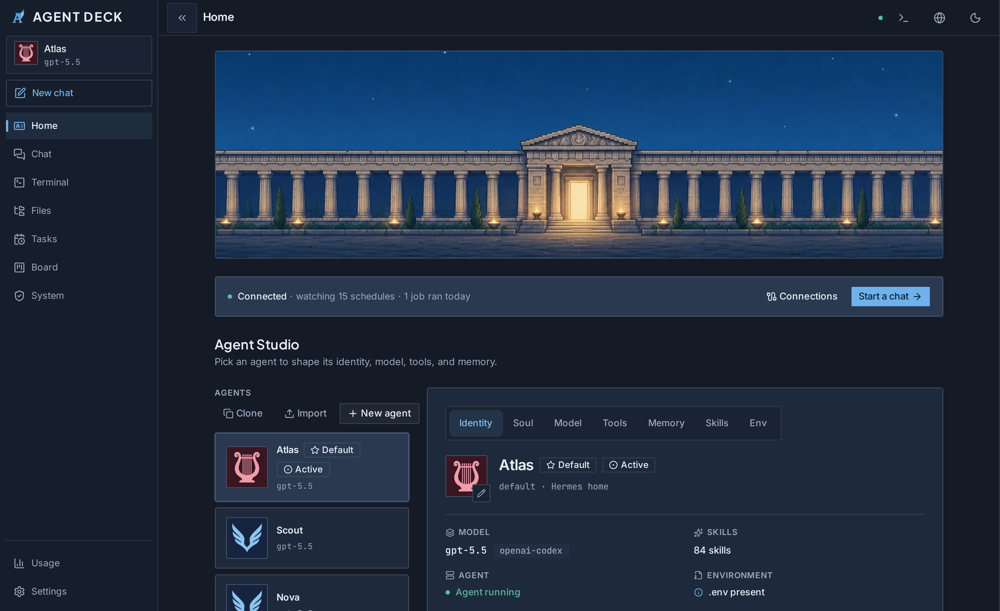
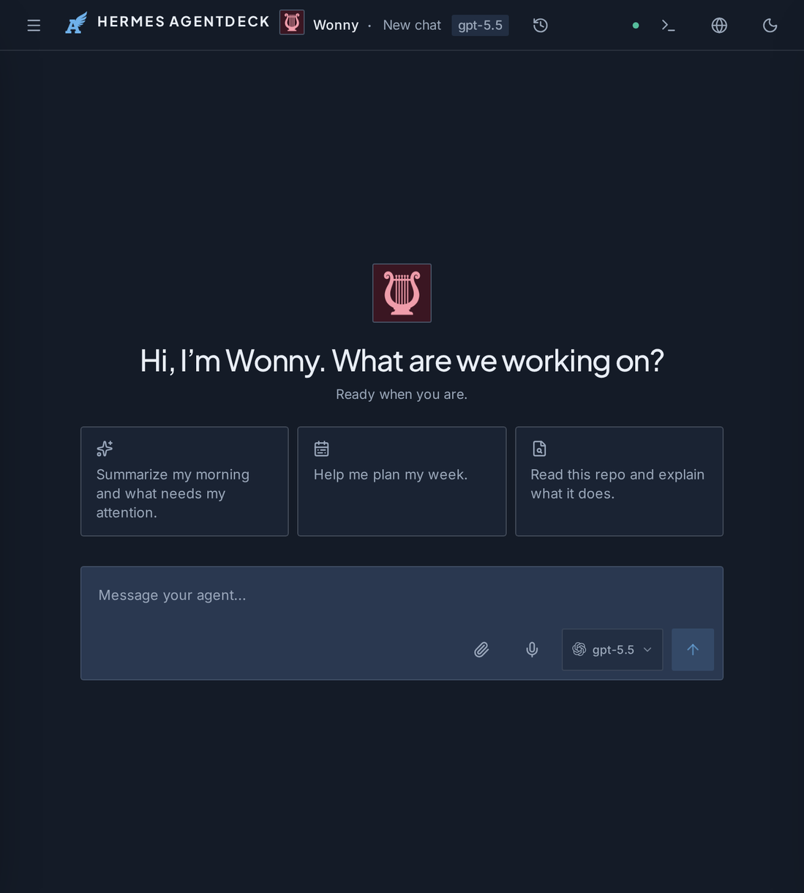
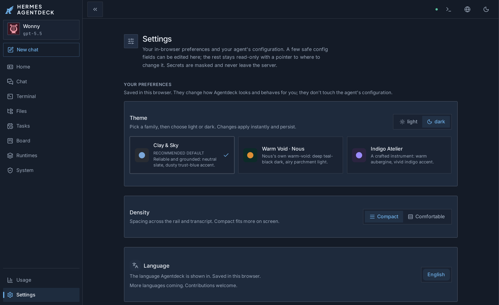

<p align="center">
  
</p>

<h1 align="center">Agentdeck</h1>

<p align="center"><strong>The AI builder's cockpit.</strong></p>

<p align="center">Run your AI agents and dev terminals on your machine, then pick them up from any device: the same live sessions and tmux panes, no reconnect.<br>A calm, local-first cockpit powered by <a href="https://github.com/NousResearch/hermes-agent">Hermes</a>, all in one browser tab.</p>

<p align="center">
  
  
  
</p>

<p align="center">
  
</p>

> **New to AI agents?** Agentdeck is a browser-based cockpit for running AI agents from your own computer. The one command in [Quickstart](#quickstart) installs everything and opens the setup wizard.

Agentdeck is a calm, local-first web UI and a third way to work with your agent, alongside the CLI and Telegram. **MIT-licensed**, yours to use, fork, and build on. No fake states, no fabricated endpoints, and no magic hiding what's real.

## Cross-device terminal workspaces

Leave your desk with three sessions running. Open your phone. Same panes, same tmux sessions, no reconnect, no setup.

The Terminal surface is a workspace manager. Each named workspace saves its pane layout server-side and reattaches the running tmux sessions from any device. A quick **Scratch** terminal gives you an ephemeral shell in one click; saved workspaces give you a persistent layout you can deep-link to from anywhere (`/workspaces/:id`).

The launcher screen detects which CLIs you have installed (Hermes CLI, Claude Code, Codex, or a raw shell) and opens each honestly: available CLIs are one click, missing ones show a real install link. No fake states, no phantom processes.

## What is Agentdeck

Agentdeck is a local-first web cockpit for your AI agents and dev terminals, reachable from any device on your network. Start a chat or a terminal on your laptop and resume it on your phone: the same live run, tmux panes, and pending approvals, with no reconnect and no setup.

It is powered by [Hermes](https://github.com/NousResearch/hermes-agent), where the gateway, agents, memory, and skills live. The built-in terminal drives any CLI you already have (Hermes, Claude Code, Codex, or a raw shell), and a unified history shows your sessions across all of them. Power users get a live Run drawer, a cross-source fleet band, Jobs/Cron, Logs, Skills, Files, and a ⌘K palette; a first-runner gets a demo path, a setup wizard, and one button to start a chat.

If Hermes is running there is nothing to configure. If a provider still needs setup, Agentdeck launches Hermes-owned browser sign-in through its BFF or sends an API key to Hermes once; the terminal is a fallback, not the only path. No fake states, no fabricated endpoints.

## Highlights

- **Run cockpit.** A live drawer that streams your agent's tool timeline, reasoning, token usage, and recent errors as a run unfolds, plus a fleet band showing sessions across `cli`, `telegram`, and `cron` in one place.
- **Instant agent switching.** Run one gateway per agent on its own port and switch agents with no restart: chat routes to the active agent on your next message, in-flight runs stay pinned to where they started, and the UI tells you honestly whether a switch was instant or needs a restart.
- **Terminal pane awareness.** A Claude Code or Codex pane surfaces what it's doing right now, read from that tool's own session log: a working/idle chip, the file it's touching, and its last tool call. No scraping, no fake states.
- **One history across runtimes.** Hermes, Claude Code, and Codex sessions in a single filterable list (All / per-runtime) with per-runtime token usage, so every agent you run is in one place. Read-only runtimes are clearly badged.
- **Cross-device terminal workspaces.** Named workspaces save pane layouts server-side and reattach tmux sessions from any device. Scratch gives you an ephemeral quick shell; saved workspaces give you persistence, start from a preset template, and export to a shareable JSON. One deep link opens the same layout on your phone.
- **Surface-aware split rail.** On Chat you get an icon-nav plus a dedicated sessions pane; everywhere else it collapses to a single rail. Toggle with ⌘B. Past sessions resume in one click and your next message continues them.
- **Three designed theme families**, each with a light and dark variant, switchable from Settings or ⌘K.
- **Streaming chat** with inline tools, reasoning, and approvals (deny, allow once, allow for session, always allow), plus stop and resume.
- **Operator surfaces:** Jobs and Cron, Logs, and Skills, alongside Models, Profiles, and Usage.
- **Agent profile controls:** profile pages expose files, skills, soul, and the active memory provider; provider switch/reset controls are scoped to the active profile and surface Hermes errors honestly.
- **Files** built in with a file browser and code editor, accessible from any device.
- **⌘K command palette** and deep keyboard support throughout.
- **Honest security and remote posture:** frictionless on loopback, bearer-gated and Host-allowlisted on a remote bind.

| Streaming chat that greets you by name                                                          | Three theme families, light and dark                           |
| ----------------------------------------------------------------------------------------------- | -------------------------------------------------------------- |
|  |  |

## Quickstart

### Option A: One-command installer (Experimental, easiest path)

> **Experimental.** Works on macOS (Apple Silicon and Intel) and Linux (x64 and arm64). Falls back to the manual path below if anything goes wrong. Re-run at any time to update.

```bash
curl -fsSL https://raw.githubusercontent.com/victorv2i/agentdeck/main/install.sh | bash
```

This installs Hermes, builds Agentdeck, and registers all three pieces (the Hermes gateway, the Hermes dashboard, and Agentdeck itself) as persistent services (systemd user units on Linux, launchd on macOS), so everything comes back after a reboot. On Linux without a systemd user session (the default in WSL2) they run as plain background processes instead, and the installer says so; re-run it after a reboot to start them again. Then it opens your browser to the setup wizard. Nothing is configured before you see the wizard; it handles provider sign-in. If you already run Hermes your own way, the installer reuses your running gateway/dashboard instead of taking them over. If port 7878 is taken, it picks the next free port and prints your address (or set `AGENT_DECK_PORT` to choose one). Curious what it will do before it runs? Use `--dry-run`:

```bash
bash install.sh --dry-run
```

**Windows:** A PowerShell installer (`install.ps1`) is planned. For now, use WSL2 and run the `curl` command above inside it.

---

### Option B: Manual setup (requires Node.js 20+ and pnpm 10)

**Prerequisites:** Node.js >= 20 and pnpm 10. Install them first if you don't have them:

```bash
# Install Node.js 20+ (if needed): https://nodejs.org/en/download
# Install pnpm 10 (if needed):
npm install -g pnpm@10

# Then clone and enter the repo:
git clone https://github.com/victorv2i/agentdeck.git
cd agentdeck
pnpm install
```

### Preview without Hermes

No Hermes backend yet? See the UI immediately with a self-contained demo:

```bash
pnpm demo
# → open http://127.0.0.1:7880
```

`pnpm demo` builds the web client and serves it against an in-process demo gateway that streams a polished, fully-fake agent run (chat, an expandable tool chip, and a live approval prompt). It never touches the real Hermes gateway or dashboard; it's purely for previewing the interface. Bookmark `http://127.0.0.1:7880` only for the preview.

### Run against your Hermes

Ready to use a real local Hermes agent. First make sure **Hermes itself is running**, both the **gateway** (`hermes gateway`) and the **dashboard** (`hermes dashboard`); Agentdeck connects to them, it does not launch them. Then start the deck:

```bash
pnpm start
# → open http://127.0.0.1:7878
```

`pnpm start` builds the web client and the server, then serves everything as one process on a fixed port. Loopback only by default: no token, no friction. (If the gateway/dashboard aren't up yet, the deck still boots; health reports `degraded` and the surfaces show honest empty/error states until Hermes is reachable.)

Bookmark `http://127.0.0.1:7878` for the real local app. Reopen it while `pnpm start` is running; for phone access, bookmark the Tailscale HTTPS URL below instead.

On first run, the app checks whether Hermes is installed and whether a usable model is connected. **Nous Portal** is the recommended browser sign-in path for Nous-hosted models, but it is not the only option: Gemini CLI OAuth uses Hermes' `google-gemini-cli` browser provider, while Google AI Studio API keys use Hermes' `gemini` provider. Anthropic, OpenRouter, OpenAI, xAI, and custom Hermes provider slugs can also be connected with an API key when needed. Browser sign-in is launched by Hermes through the BFF, and API keys are sent once to Hermes; Agentdeck does not keep provider credentials in the browser.

Terminal fallback is still honest and narrow: use it to install Hermes, start Agentdeck, or run a provider auth flow that Hermes cannot start from the browser. Do not expect Agentdeck to own provider OAuth tokens or install Hermes silently.

### Phone / remote access (Tailscale)

The cleanest way to reach the deck from your phone is to keep it on loopback and front it with **Tailscale Serve**, which gives you HTTPS, a _secure context_, which browser notifications, voice input, and clipboard all require:

```bash
AGENT_DECK_FORCE_AUTH=1 AGENT_DECK_REMOTE=1 AGENT_DECK_TOKEN=choose-a-long-token pnpm start
tailscale serve --bg http://127.0.0.1:7878   # → https://your-host.ts.net:7878 on your tailnet
```

Then open `https://your-host.ts.net:7878` from any tailnet device. The shell loads, but the app asks for the access token before mounting the Hermes surfaces. `AGENT_DECK_REMOTE=1` also uses the remote terminal posture, so the interactive terminal stays off unless you explicitly enable it.

You _can_ instead bind directly to your Tailscale host, but note that a plain **`http://…ts.net`** origin is **not** a secure context, so the browser silently disables notifications, voice input, and clipboard:

```bash
AGENT_DECK_HOST=your-host.ts.net pnpm start
# then open http://your-host.ts.net:7878 from any tailnet device
```

A non-loopback bind turns on the auth described in [Security](#security). The server prints a bearer token once at startup (or set `AGENT_DECK_TOKEN` to pin one). For reach-me when the tab is closed (true off-device notifications), use Hermes's Telegram channel; Agentdeck's browser notifications only fire while the tab is open.

**Behind a reverse proxy on your own domain** (nginx / Caddy / Cloudflare / Traefik → `127.0.0.1:7878`): the browser sends your domain as the `Host`, which the DNS-rebinding guard rejects by default. Allow your front-door name(s) with `AGENT_DECK_TRUSTED_HOSTS` (comma-separated), which the Host- and Origin-allowlists (HTTP, chat WS, and terminal WS) honor in addition to loopback / `*.ts.net`:

```bash
AGENT_DECK_FORCE_AUTH=1 AGENT_DECK_REMOTE=1 AGENT_DECK_TOKEN=choose-a-long-token \
  AGENT_DECK_TRUSTED_HOSTS=deck.example.com pnpm start
```

## How it connects to Hermes

Agentdeck is a thin client and local BFF over stock Hermes:

- **Chat** goes to the Hermes gateway (`/v1/runs`); the deck reads its port from your `~/.hermes/config.yaml` (`API_SERVER_PORT`), defaulting to the stock `:8642`, and streams it back as tools, reasoning, and approvals.
- **Data surfaces** (sessions, config, models, usage) come from the Hermes dashboard data API.
- **Provider setup** uses real Hermes paths: browser OAuth is proxied through the dashboard's provider-OAuth routes, and the API-key fallback runs guarded `hermes auth add` from the BFF.

If Hermes is up, there's nothing to configure. If it isn't, the app still boots and serves the UI: health reports `degraded` and data surfaces show empty/error states instead of crashing.

**Multiple agents, instant switching.** A stock gateway binds one profile for its process life, so switching agents normally means a restart. Run one gateway per profile on its own port (set `API_SERVER_PORT` in each `~/.hermes/profiles/<name>/config.yaml`, or map them with `AGENT_DECK_GATEWAY_PORTS`) and the deck routes chat to whichever agent is active, switching on the next message with no restart. In-flight runs stay pinned to the gateway they started on. When a target agent has no gateway of its own, the switch stays honest: it applies after a gateway restart.

Defaults (override via env vars):

```
HERMES_GATEWAY_URL        chat gateway       (default: config.yaml API_SERVER_PORT, else http://127.0.0.1:8642)
HERMES_DASHBOARD_URL      dashboard data API (default http://127.0.0.1:9119)
HERMES_DASHBOARD_HOST     Host the dashboard authorizes (default 127.0.0.1:9119)
HERMES_HOME               hermes home dir (default ~/.hermes; profile-aware)
API_SERVER_KEY            gateway bearer key (else read from ~/.hermes/config.yaml)
AGENT_DECK_GATEWAY_PORTS  optional profile=port overrides for multi-agent routing (e.g. default=8642,work=8643)
```

The local BFF holds the gateway key and dashboard session token server-side. Hermes owns provider OAuth tokens and API-key persistence. They are never logged per-request or returned to the browser.

## Security

The model is simple: **loopback is frictionless, remote is gated.**

- **Loopback bind** (`127.0.0.1` / `localhost` / `::1`): no token, nothing to set up.
- **Non-loopback bind:** every `/api/*` request (except the public health probe) and both Socket.IO handshakes require a bearer token. Set `AGENT_DECK_TOKEN`, or let the server print a fresh one once at startup. The server also enforces a `Host` allowlist (loopback / `*.ts.net` / the bound host) as DNS-rebinding defense and sends hardening headers (`nosniff`, `X-Frame-Options: DENY`, a CSP).
- **Loopback behind a proxy:** use `AGENT_DECK_FORCE_AUTH=1 AGENT_DECK_REMOTE=1` with Tailscale Serve so a loopback process still requires the bearer gate and uses the remote terminal posture.
- **Terminal is off by default on remote binds.** Loopback only unless you explicitly enable it.

The access token is not injected into HTML. Remote/proxied browsers load the public shell, then enter the token printed by the server before any gated API or Socket.IO namespace is mounted. Still treat remote access as sensitive: the real network boundary is your Tailscale ACL or LAN firewall.

## Development

A pnpm monorepo:

- `apps/web`: React 19 + Tailwind v4 + shadcn/ui client (Vite).
- `apps/server`: Fastify BFF that holds credentials and exposes a clean `/api/agent-deck/*` surface plus the Socket.IO namespaces.
- `packages/protocol`: shared TypeScript wire-contract types.

Architecture: React client → Fastify BFF → Hermes gateway `:8642` (`/v1/runs`) + the dashboard data API.

**Prerequisites:** Node.js >= 20, pnpm 10.

```bash
pnpm install                 # install workspace dependencies
npx playwright install chromium  # one-time: the browser e2e in `pnpm verify` needs it
pnpm dev                     # Fastify on :7878 + Vite on :5173, hot reload
pnpm verify                  # full gate: format, lint, typecheck, test, build, e2e
pnpm check:public-readiness  # release blocker scan for placeholders/stale public claims
```

`pnpm dev` runs two processes with hot reload: Vite (`:5173`) proxies `/api` and `/socket.io` to Fastify (`:7878`). Use it while developing the UI. `pnpm start` (or `./bin/agent-deck` from any directory) runs the single built process. Use it to run locally.

### Environment variables

```
AGENT_DECK_HOST           bind host (default 127.0.0.1; set a *.ts.net host/IP for remote)
AGENT_DECK_PORT           bind port (default 7878)
AGENT_DECK_TOKEN          bearer token required on gated binds (auto-generated if unset)
AGENT_DECK_FORCE_AUTH     require bearer auth even on loopback, for proxy/Tailscale Serve
AGENT_DECK_REMOTE         force remote posture even on loopback, keeping terminal gated
AGENT_DECK_TRUSTED_HOSTS  comma-separated extra hostnames to allow (reverse proxy / custom domain)
```

(Hermes connection vars are listed under [How it connects to Hermes](#how-it-connects-to-hermes).)

## Contributing

Issues and PRs are welcome. Before opening a PR, run `pnpm verify`; it's the same gate CI uses (format, lint, typecheck, test, build, e2e). Keep changes surgical and match the existing style. See [CONTRIBUTING.md](CONTRIBUTING.md) for the dev loop and contribution ethos.

The default `pnpm e2e` gate is hermetic and reproducible on a fresh clone: it boots its own mock BFF/web on dedicated ports (`7899`/`5199`, never reused), so it passes even if you have a dev server running on `:7878`/`:5173`. Two browser checks are excluded from the gate and opt-in only, since they run against a deployment you must start yourself:

```bash
AGENT_DECK_SMOKE=1 pnpm e2e --project=smoke        # deployment check: loads the app on :5173/:7878 (theme/health-dot)
AGENT_DECK_LIVE_SMOKE=1 pnpm e2e --project=live     # live check: drives a real streamed reply via the hermes gateway :8642
```

## License

[MIT](LICENSE).

### Trademarks

"Claude" and "Claude Code" are trademarks of Anthropic; "Codex" is a trademark of OpenAI; "Hermes" is a project of Nous Research. Agentdeck is an independent project and is not affiliated with, endorsed by, or sponsored by any of them. The Terminal launcher only launches the CLIs **you already have installed** on your own machine; the names are used solely to identify those tools.
